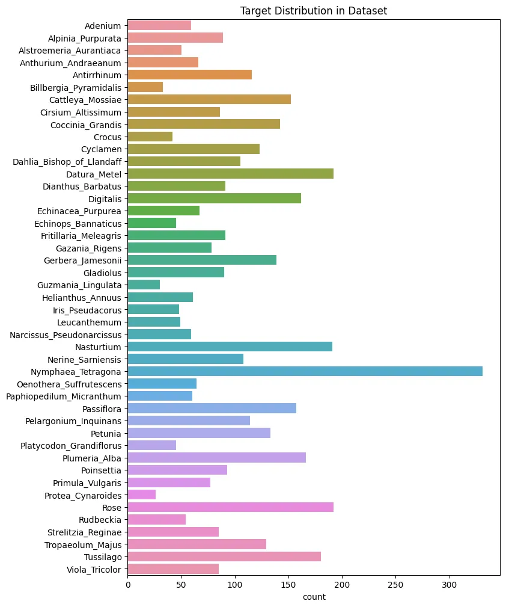
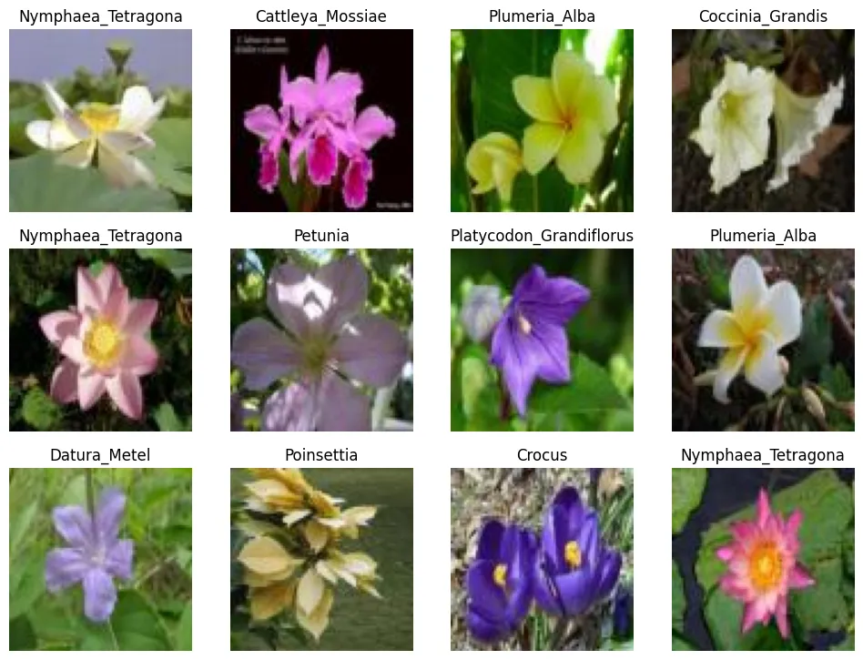

# Scikit-Image Model Deployment

```python
import collections
from glob import glob
import matplotlib.pyplot as plt
from matplotlib import patches
import numpy as np
import os
import pandas as pd
import pickle
import re
from scipy import ndimage
from skimage import (
    io,
    color,
    exposure,
    transform,
    feature
)
import seaborn as sns
```

## Image Dataset Preparation

### Get Image Dataset from Local Directory

```python
# get list of classes https://www.robots.ox.ac.uk/~vgg/data/flowers/102/index.html
data_dir = os.listdir('./labelled_data')
print(data_dir)
# ['Adenium', 'Alpinia_Purpurata', 'Alstroemeria_Aurantiaca', 'Anthurium_Andraeanum', 'Antirrhinum', 'Billbergia_Pyramidalis', 'Cattleya_Mossiae', 'Cirsium_Altissimum', 'Gazania_Rigens', 'Gerbera_Jamesonii', 'Gladiolus', 'Guzmania_Lingulata', 'Helianthus_Annuus', 'Iris_Pseudacorus', 'Leucanthemum', 'Narcissus_Pseudonarcissus', 'Nasturtium', 'Nerine_Sarniensis', 'Nymphaea_Tetragona', 'Oenothera_Suffrutescens', 'Paphiopedilum_Micranthum', 'Passiflora', 'Pelargonium_Inquinans', 'Petunia', 'Platycodon_Grandiflorus', 'Plumeria_Alba', 'Poinsettia', 'Primula_Vulgaris', 'Protea_Cynaroides', 'Rose', 'Rudbeckia', 'Strelitzia_Reginae', 'Tropaeolum_Majus', 'Tussilago', 'Viola_Tricolor', 'Coccinia_Grandis', 'Fritillaria_Meleagris', 'Crocus', 'Cyclamen', 'Dahlia_Bishop_of_Llandaff', 'Datura_Metel', 'Dianthus_Barbatus', 'Digitalis', 'Echinacea_Purpurea', 'Echinops_Bannaticus']
```

```python
glob('./labelled_data/{}/*.jpg'.format('Helianthus_Annuus'))

# ['./labelled_data/Helianthus_Annuus/image_05416.jpg',
#  './labelled_data/Helianthus_Annuus/image_05435.jpg',
#  './labelled_data/Helianthus_Annuus/image_05399.jpg',
#  ...
```

```python
all_files = []
for subfolder in data_dir:
    all_files += glob('./labelled_data/{}/*.jpg'.format(subfolder))
    
len(all_files)
# 4555
```

```python
data_collection = io.ImageCollection(all_files)
data_collection.files
# ['./labelled_data/Adenium/image_04767.jpg',
#  './labelled_data/Adenium/image_04768.jpg',
#  './labelled_data/Adenium/image_04769.jpg',
#  ...
```

```python
len(data_collection)
```

```python
data_collection.files[4554]
```

### Resize to 80,80,3

```python
c = 0

for image in data_collection:
    img_ori = io.imread(data_collection.files[c], as_gray=False)
    img_thumb = transform.resize(img_ori, output_shape=(80, 80, 3), anti_aliasing=True)
    plt.imsave(data_collection.files[c], img_thumb)
    c = c + 1
```

### Get Image Labels from Folder Structure

```python
# use regular expression to extract folder name as label - example:
re.search(
    r'./labelled_data/(.*?)/',
    './labelled_data/Helianthus_Annuus/image_04481.jpg'
).group(1)
# label extracted: 'Helianthus_Annuus'
```

```python
def extract_labels(location):
    label = re.search(
        r'./labelled_data/(.*?)/', location
    ).group(1)
    
    return label
```

```python
labels = list(map(extract_labels, data_collection.files))
list(set(labels))
# ['Oenothera_Suffrutescens',
#  'Plumeria_Alba',
#  'Cyclamen',
#  ...
#  'Nasturtium',
#  'Helianthus_Annuus']
```

### Dataset Export

```python
def buffer(item):
    return item

# dataset_arrs = np.array(list(map(buffer,dataset)))
dataset_list = list(map(buffer, data_collection))
dataset_array = np.asarray(dataset_list)
dataset_array.shape
# (4555, 80, 80, 3)
```

```python
data_dict = dict()

data_dict['description'] = '4555 80x80 RGB images of 45 classes.'
data_dict['data'] = dataset_array
data_dict['target'] = labels
data_dict['labels'] = set(labels)
```

```python
label_distribution = collections.Counter(data_dict['target'])
```

```python
plt.figure(figsize=(8, 12))
plt.title('Target Distribution in Dataset')

sns.countplot(
    data=data_dict,
    y='target',
    orient='v'
)

plt.savefig('assets/Scikit_Image_Model_Deployment_01.webp', bbox_inches='tight')
```



```python
# plot multiple random images with labels
ran_gen = np.random.default_rng()

plt.figure(figsize=(12, 12))

for i in range(12):
    ax = plt.subplot(4, 4, i+1)
    random_index = ran_gen.integers(low=0, high=4555, size=1)
    plt.imshow(data_dict['data'][random_index[0]])
    plt.title(data_dict['target'][random_index[0]])
    plt.axis(False)

plt.savefig('assets/Scikit_Image_Model_Deployment_02.webp', bbox_inches='tight')
```



```python
# save the dateset
output = open('./flowers.pkl', 'wb')
pickle.dump(data_dict, output)
```
